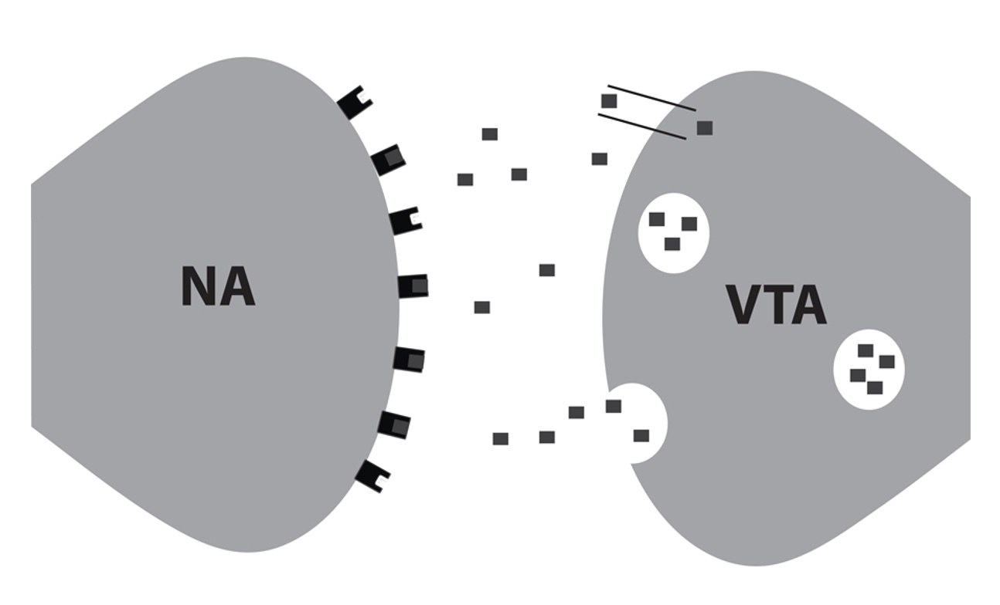

<h1>Can too much dopamine protect you from addiction?</h1>

Before I answer that, I’m going to have to draw you another picture:

This is a close-up picture of where the arm of the dopamine-producing VTA neuron comes up close to the body of an NA neuron. The neuron on the right is the VTA neuron and the little squares are dopamine molecules. Some are being packaged for release and some are being released right now. The straight tube near the top of the neuron is something new you haven’t heard about here yet: a dopamine transporter. The dopamine transporter is like a vacuum cleaner that sucks up all the extra dopamine so it can be recycled. The neuron on the left is the NA neuron. Those figures on it are the dopamine receptors. So, the dopamine is released by the VTA, stays in the area between the cell (the synapse), and acts on the dopamine receptors. This picture lets us make up a kind of equation for dopamine tone or dopamine signal:

DA tone = DA molecules X DA receptors X TIME

Where TIME is the amount of time the dopamine molecules are in the synapse. The dopamine transporters determine the time. The more receptors and the better they work, the less time the dopamine stays out to produce a signal. So, the equation can be written as:

DA Tone = DA molecules X DA Receptors
			DA transporters

Now that you know what determines the dopamine tone let’s look at how dopamine tone can protect someone from addiction. In a recent study at Brookhaven National Laboratory, researchers looked at non-alcoholics with at least three first-degree alcoholic relatives. You would expect such a person to have a high risk of alcoholism, and the question is, “Why aren’t they alcoholic?” Well, it turns out that they have a higher-than-normal level of dopamine receptors and can feel positive rewards better than most people<a name="ref4" href="#foot4">[4]</a>. Here’s a group that you’d expect, from family history, to not be able to feel reward and to crave alcohol. But they are different not only from their family but from most people because they have more dopamine receptors than normal, a very protective trait. They feel naturally what people with addiction want to feel and can feel a bit when they are using.

But there are also people who have way too much dopamine function, and they have problems, too. Too much dopamine function usually makes you anxious and not in the normal way. Too much dopamine makes you so focused that everything seems important, and you become compulsive and obsessive. Many such people have repetitive panic attacks or Obsessive-Compulsive Disorder, a serious mental illness that can destroy people’s lives. Such people sometimes look for sedatives to make them feel better (they don’t like cocaine or stimulants as they make them feel worse). They can, using sedatives, damage the VTA enough to become addicted.

This is a very important point that can get lost in learning about the neurobiology of addiction. While most people, I believe, have addiction because of an inborn or genetic problem, some can have it develop because of the use of a drug. But remember that this is the path of the minority of people with addiction. So, the thing that is protective isn’t too much dopamine but the right amount of dopamine; too much can be a problem for developing addiction as well.

<a name="foot4" href="#ref4">[4]</a>: Volkow ND, et al. High Levels of Dopamine D2 Receptors in Unaffected Members of Alcoholic Families: Possible Protective Factors. Arch Gen Psychiatry 2006 Sep; 63(9):999-1008.
