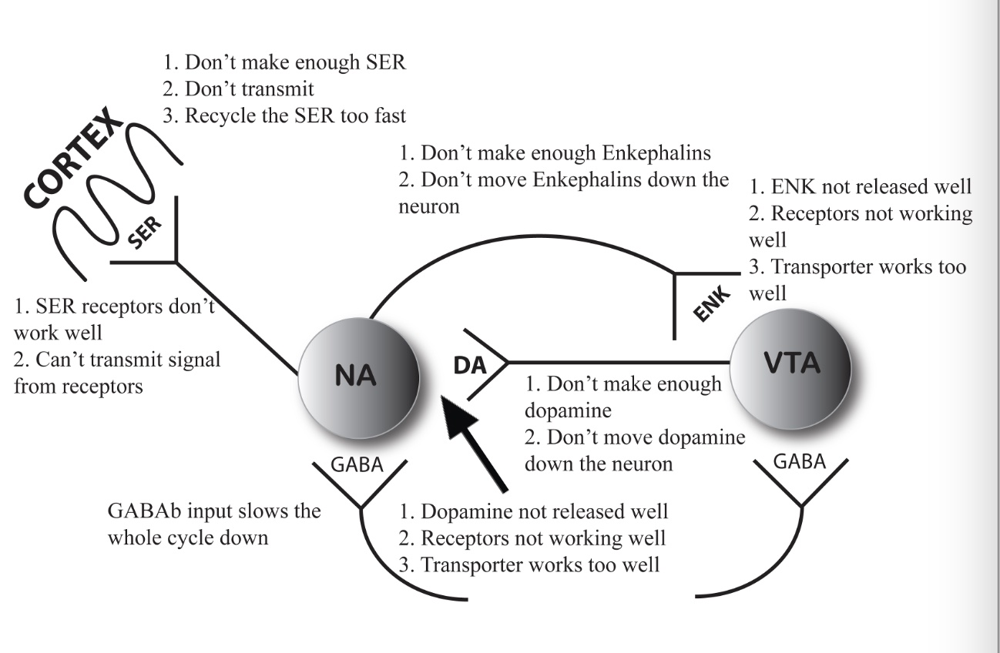

<h1>
Can you put all the neurobiology stuff together in one picture along with what can go wrong?
</h1>

Boy, you don’t ask for much, do you? Okay, I’ll describe it and try to draw a picture.
First, the basics of addiction are the inability to stop or moderate the reward when using and, when not using, to be constantly thinking about the reward and highly prone to using. There are three parts of the brain that bear on these two characteristics:

1.	the dopamine/enkephalin feedback loop in the MFB
2.	the glutamine signal to the MFB that can trigger relapse
3.	the Periaqueductal Gray that handles withdrawal.

In the MFB, dopamine is produced and the reward causes it to be released to act on the reward center. That dopamine release causes a release of enkephalins, which prompt a further dopamine release, and this goes around and around until the dopamine is exhausted. The reward center also sends a signal to the front part the brain that instills positive self-esteem. If the enkephalin part or the dopamine part doesn’t work right, the reward center doesn’t send that signal as well as it should. Other things besides dopamine release can affect the dopamine signal. If the dopamine receptor isn’t up to par, the signal won’t get through as well. If the dopamine transporter recycles the dopamine too fast, it won’t be there long enough to produce a good signal. Other things can be wrong as well: don’t make enough dopamine, don’t get dopamine down to the end of the neuron, don’t release enough dopamine in each packet, don’t release enough packets with each reward, don’t send the signal from the receptors, or don’t transmit the signal to the frontal cortex. And you can increase the list by thinking of everything that can go wrong in the enkephalin part of the cycle as well.

If you don’t have enough dopamine signal, you will not be able to concentrate; you will feel restless, irritable, and discontented. You may have low self-esteem and feel as if you don’t fit into the world. Because you’ll enjoy few regular activities, not much will motivate you and you’ll have problems with procrastination and motivation. When you use the reward that works for you, your level will be high enough to feel normal and you’ll stop using for a bit. When the level falls, the signal will actually go lower than it was when it started so that you’ll feel compelled to use again. This is the basis of not being able to stop once started.

The glutamate signal to the MFB is more about triggering with cues and relapse. Anything can do it; a person, place, or thing is sufficient. Also a time of day, a weather pattern, or a news event are all things that could be a cue for a trigger. The glutamate signal sets off the MFB, and you get the drop in level even without using the reward. Once the level drops the person will feel compelled to use.

The Periaqueductal Gray handles withdrawal and since we use drugs systemically, taking a drug while in withdrawal will calm the symptoms. The PG does have a connection with the MFB that causes the dopamine level to fall, just like hunger or thirst would. That’s what lets us know it’s the drug we need to stop the withdrawal.
Sorry, but you’ll have to turn the book sideways to see the picture.

