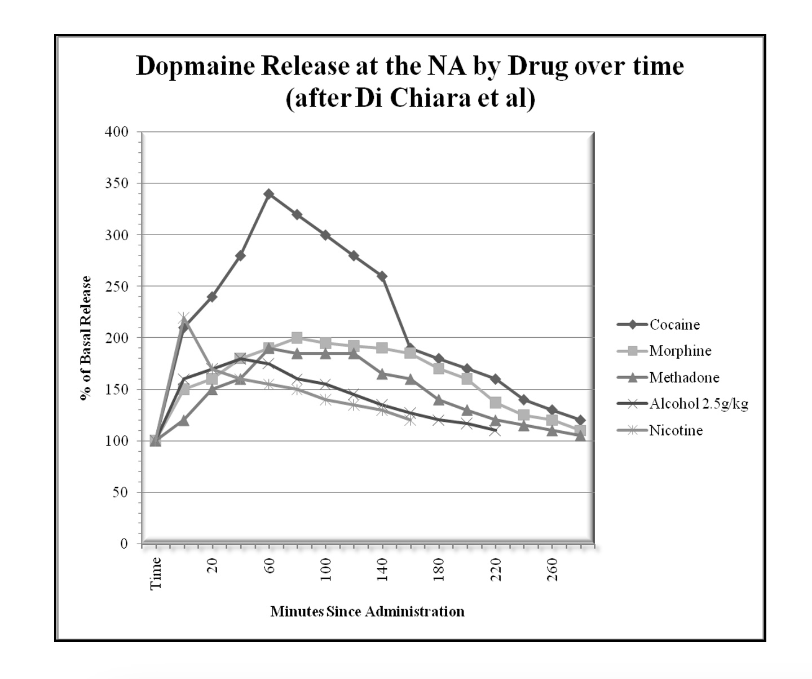
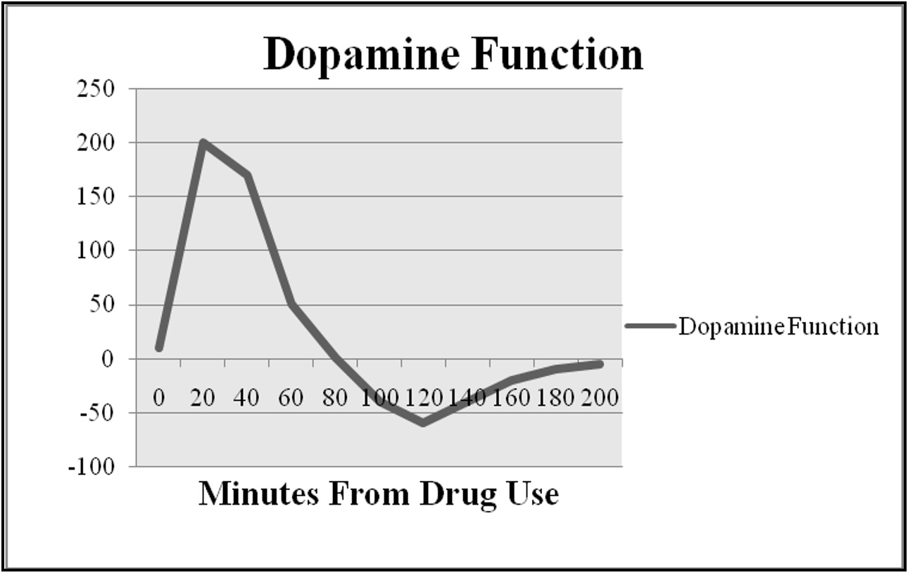

<h1>So what happens when we take a drug?</h1>

You would probably think that the answer is something that has only recently been discovered but that’s not so. In 1988, two Italian researchers<a name="ref3" href="#foot3">[3]</a> published a paper that showed exactly what happened to dopamine levels in the brain after the administration of drugs. They were able to do this with an ingenious method of real-time measurement of the dopamine release at the Nucleus Accumbens. What they found was that regardless of drug class (sedative, narcotic, stimulant, or nicotine) they all released dopamine at the Nucleus Accumbens. The behavioral effects of the drug could be blocked by blocking the dopamine receptor. The dopamine blocker also blocks the behavioral response to food.

In addition to blocking the effects by blocking dopamine receptors, the drugs’ effects could be blocked by various other means, according to the drug being affected. For instance, opioid blockers blocked the effect of morphine and methadone, while nicotine receptor blockers blocked the effect of nicotine. So, it’s been a while now that we’ve known, or should have known, that while drugs work via different receptors and different methods to make the reward system activated, they all produce the same final common effect, reward system activation. While it took scientists a long time to figure that out, it seems pretty much like common sense when you think about it. If it doesn’t activate the reward system, why use it twice?

As you can see by the chart, the drugs work at different time intervals, and it looks like everything returns to normal after the drugs wear off. But we must remember that the dopamine level isn’t the whole story. What counts is the dopamine tone, which is a combination of how much dopamine is there for how long and how many receptors we have to see the dopamine.

As the dopamine level spikes, the receptors go away to protect the system from too much dopamine. The more dopamine released the more receptors will go away. So, while the amount of dopamine at 100 minutes after taking a drug might look like it’s higher than normal, the person will feel worse than when he started because there are fewer dopamine receptors, and less dopamine signal will get through. So, instead of being a peak and a slow return to normal, it really feels something like this:

<a name="foot3" href="#ref3">[3]</a>: Di Chiara G and Imperato A. Drugs Abused by Humans Preferentially Increase Synaptic Dopamine Concentrations in the Mesolimbic System of Freely Moving Rats. Proceedings of the National Academy of Sciences of the US of A 1988;85: 5274-5278.
